# LLM-as-a-Judge

Use an LLM to score LLM app output based on custom evaluation criteria.
More accurate alterrnatives to BLEU and ROUGE.

You pass the input and output of the LLM app along with context and optionally a reference and ask the LLM to judge it.

By judge we mean, we could ask the LLM to generate a score for the output, say a score between 0 and 10, or we could give the LLM judge a number of outputs from different versions of the LLM app and ask the LLM to rank them.

G-eval

LLM arena

Single turn LLM as a judge:
A single input and output combo is passed to the LLM as a judge.

Multi turn LLM as a judge:
Entire conversation are sent to the LLM as a judge

```mermaid
graph TD
    subgraph SingleTurn [Single-Turn LLM-as-a-Judge]
        S1[Single-Turn Interaction<br><br>&#128100;: What day is it today?<br><br>&#129302;: How would I know?]
        L1[&#9878; LLM-as-a-Judge<br><br>Give a score of 1 - 10 based on how coherent<br>is the output based on the input]
        V1((Verdict Score<br>10))

        S1 -.-> L1
        L1 --> V1
    end

    subgraph MultiTurn [Multi-Turn LLM-as-a-Judge]
        M1[Multi-Turn Interaction<br><br>&#128100;: What day is it today?<br><br>&#129302;: How would I know?<br><br>&#128100;: Can't you search the web?<br><br>&#129302;: It's deprecated...]
        L2[&#9878; LLM-as-a-Judge<br><br>Give a score of 1 - 10 based on how coherent<br>the conversation is]
        V2((Verdict Score<br>10))

        M1 -.-> L2
        L2 --> V2
    end

    style S1 fill:#fff,stroke:#333,stroke-width:1px,stroke-dasharray: 5 5
    style L1 fill:#fff5e6,stroke:#d3c4a7,stroke-width:2px
    style V1 fill:#e0f7fa,stroke:#00acc1,stroke-width:2px

    style M1 fill:#fff,stroke:#333,stroke-width:1px,stroke-dasharray: 5 5
    style L2 fill:#fff5e6,stroke:#d3c4a7,stroke-width:2px
    style V2 fill:#e0f7fa,stroke:#00acc1,stroke-width:2px
```

There are three types of LLM as a Judge:
1. Single-output (without reference)
2. Single-output (with reference)
3. Pairwise 

How is this effective?

Separation of concerns, the task the LLM has to do is different and often simpler.

LLM as a Judge scoring methods:

1. G_Eval

2. DAG : Use LLMs like you would in an agent. Break the scoring down to decisions, form a tree of decisions that the LLM can make that leads to a leaf node that represents the score.   

Read from Improving LLM Judgements. 

Sources 

https://www.confident-ai.com/blog/why-llm-as-a-judge-is-the-best-llm-evaluation-method#tldr